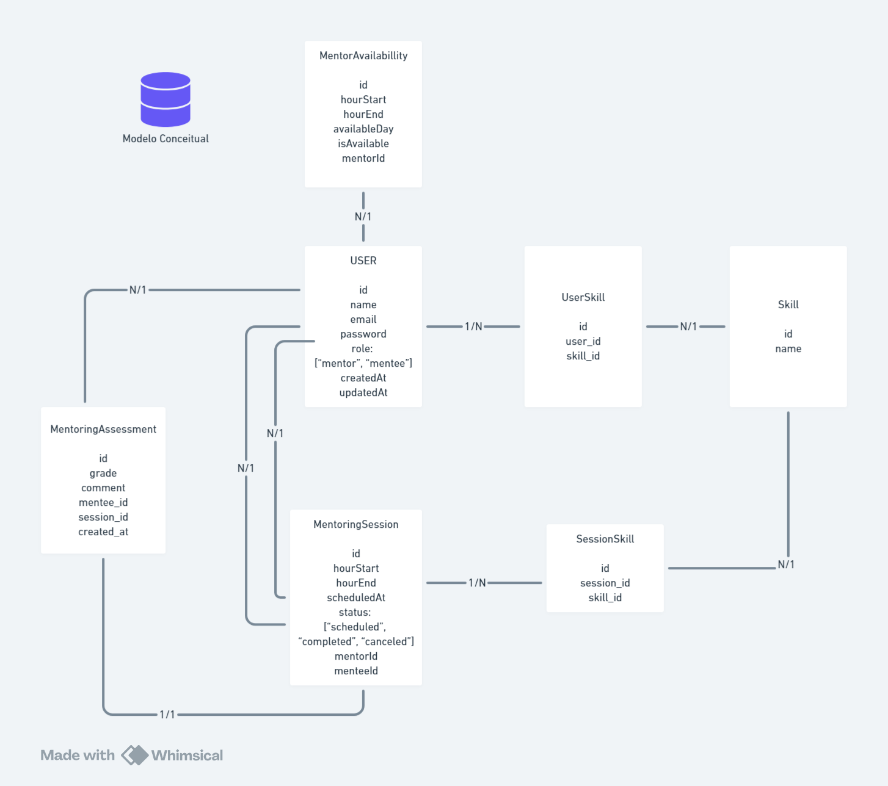

# Mentoring Platform API

Backend para uma plataforma de mentorias. Onde o objetivo é atender a dois públicos distintos: pessoas que possuem habilidades e estão dispostas a oferecer mentoria, e pessoas que precisam de mentoria nessas habilidades. 


### Como configurar o projeto

#### **Requisitos**

[Instalação do Node](https://nodejs.org/en/download/package-manager)

[Instalação do Docker](https://docs.docker.com/engine/install/)

[Instação do Git](https://git-scm.com/download/win)

#### **Etapas**

1. Clonar o repositório.
	```
	git clone https://github.com/WesleyDRC/bossa-invest-backend-challenge.git
	```
2. Instalar dependências.
	```
	npm install
	```

3. Crie `.env` na raiz do projeto e cole o **conteúdo** `.env.example` nele.

4. Para **rodar** o banco de dados **MySQL** com **Docker**, digite o comando abaixo no terminal na raiz do repositório.
	```
	docker compose up -d --build
	```

5. Para **rodar** a aplicação, digite o comando abaixo no terminal na raiz do repositório.
	```
	npm start
	```
6. Para **rodar** os testes, digite o comando abaixo no terminal na raiz do repositório. 
	```
	npm test
	```
7. Exporte o arquivo **JSON** localizado na pasta `insomnia` dentro do Insomnia para realizar as consultas.

### Decisões

* **Por que Express?**

	Express é um framework da web do Node.js bem flexível, que me permite adicionar funcionalidades conforme necessário.

* **Por que TypeScript?**

	TypeScript adiciona tipagem estática ao JavaScript, ajudando a	 identificar erros em tempo de compilação e ele se integra bem com o framework Express. Além de que eu já possuo familiaridade com a linguagem, facilitando o desenvolvimento do projeto.

* **Por que MySQL?**

	Escolhi MySQL como meu banco de dados, por ser um banco de dados amplamente utilizado e possuir uma boa interface gráfica para gerenciamento( MySQL Workbench ). Minhas experiências anteriores com MySQL em outros projetos também contribuiram para uma configuração mais tranquila.


* **Por que TypeORM?**

	Usei TypeORM porque eu já tinha conhecimento sobre o ORM, e ele se intregra bem com TypeScript. Além de que ele facilita bem o trabalho com consultas ao banco de dados.

* **Por que Tsyringe?**

	Tsyringe é uma ferramenta para injeção de dependências. Ele ajuda muito bem a organizar e gerenciar as dependências de forma clara. 


* **Por que JOI?**

	Usei JOI para validar dados de entrada, garantindo que os dados estejam no formato esperado antes de passar para os controllers.


### Pontos a melhorar
	
* Validar todos os dados de entrada;
* Testes unitários.

### Modelo Conceitual do banco de dados


### Estrutura do projeto

Optei por usar uma arquitetura monolítica modular, pois assim consigo separar minha aplicação em diferentes módulos, garantindo uma organização clara e modular, tornando mais fácil de entender e navegar pelo código.

- `src/`: Contém todo o código fonte da aplicação.

	- `modules`: Aqui se encontra os módulos funcionais da aplicação. Cada módulo possui sua própria pasta com seus componentes, como por exemplo: controllers, services, domain, etc.

		`<Nome do módulo>`
		- `contants`: Contém frases relevantes para o usuário;
		- `controllers`: Recebem os dados do usuário, chamam a camada de serviço e retornam uma resposta ao usuário;
		- `domain`: Contém as interfaces das entidades e classes com regras de negócio específicas;
		- `dtos`: Definem a forma dos dados transferidos;
		- `entities`: Representam os modelos de dados mapeados para as tabelas do banco de dados;
		- `repositories`: Interfaces e implementações para acesso a dados do banco de dados;
		- `routes`: Contém as rotas do módulo;
		- `services`: Contém a lógica de negócios e chamam o repositório.
	
	- `shared`: Contém arquivos que são compartilhados entre os módulos.
		
		- `container`: Configura a injeção de dependência usando tsyringe.
		- `middlewares`: Middlewares globais, como por exemplo: autenticação ou garantir se o usuário tem permissão para acessar um determinado recurso;
		- `routes`: Ponto central para chamar as rotas de cada módulo;
		- `typeorm`: Configuração para se conectar ao banco de dados;
		- `utils`: Funções comuns e reutilizáveis;
	- **app**: Configuração da aplicação;
	- **server**: Inicia o servidor em determinada porta.

### Como me localizar no projeto

- Todas as rotas estão em ./src/shared/routes;
- A configuração para se conectar ao banco de dados usando typeorm está em: `./src/shared/typeorm`;
- A configuração para iniciar o servidor com express está em: `./src/shared/app.ts`


### Recursos da API

* **Authentication**

1. Autenticar usuário

	**Descrição**: Autentica um usuário e retorna um token JWT.

	```
	Endpoint: POST /auth

	Input:
	Body Type: JSON
	{
		"email": "string", // Nome do usuário.
		"password": "string" // Senha do usuário.
	}

	Output:
	{
		"token": "string" // Token JWT
	}
	```

* **Users**
1. Criar usuário

	**Descrição**: Registra um usuário e retorna os dados do usuário criado.

	```
	Endpoint: POST /users

	Input:
	Body Type: JSON
	{
		"name": "string", // Nome do usuário.
		"email": "string", // O endereço de email do usuário. 
		"password":"string", // A senha do usuário.
		"confirmPassword": "string", // Confirmação da senha do usuário.
		"role": "string" // Pode ser "mentor" ou "mentee".
	}

	Output:
	{
		"user": {
			"id": "string", // ID do usuário.
			"name": "string", // Nome do usuário criado.
			"email": "string", // O endereço de email do usuário criado. 
			"role": "string", // Papel do usuário criado.
			"created_at": "string", // Data e hora em que o usuário foi criado.
			"updated_at": "string" // Data e hora da última atualização do usuário.
		} 
	}
	```
2. Adicionar skill ao mentor.

	**Descrição:** Registra uma skill para um mentor.

	**Observação:** Somente mentores podem possuir skills.

	```
	Endpoint: POST /users/skills

	Headers:
	Authorization: Bearer <token>

	Input:
	Body Type: JSON
	{
		"skillName": "string" // O nome da habilidade a ser adicionada ao mentor.
	}

	Output:
	{
		"user": {
			"id": "string" // ID do usuário.
			"name": "string" // Nome do usuário criado.
			"email": "string", // O endereço de email do usuário criado. 
			"role": "string", // Papel do usuário na plataforma de mentoria (mentor ou mentee).
			"skills": [
				{
					"id": "string", // ID da habilidade.
					"name": "string" // Nome da habilidade.
				}
			],
			"created_at": "string", // Data e hora em que o usuário foi criado.
			"updated_at": "string" // Data e hora da última atualização do usuário.
		}
	}
	```
3. Pegar skills de um mentor

	**Descrição:** Retorna as habilidades de um mentor.

	**Observação:** Apenas mentores podem consultar suas próprias habilidades.

	```
	Endpoint: GET /users/skills
	
	Headers:
	Authorization: Bearer <token>

	Output:
	{
		"skills": [
			{
				"id": "string", // ID da habilidade.
				"name": "string" // Nome da habilidade.
			}
		]
	}
	```

4. Procurar mentores pela habilidade

	**Descrição:** Retorna os mentores que possuem conhecimento sobre uma habilidade.

	```
	Endpoint: GET /users/skills/mentors?skill=NOME_DA_HABILIDADE
	
	Headers:
	Authorization: Bearer <token>

	Output:
	{
		"mentors": [
			{
				"id": "string", // ID do mentor.
				"name": "string", // Nome do mentor.
				"email": "string", // Email do mentor.
				"role": "string", // Papel do mentor (mentor).
				"created_at": "string",  // Data e hora em que o mentor foi criado.
				"updated_at": "string", // Data e hora em que o mentor foi atualizado.
				"skills": [
					{
						"id": "string", // ID da habilidade.
						"name": "string" // Nome da habilidade.
					}
				]
			}
		]
	}
	```

* Skills

1. Criar uma habilidade

	**Descrição:** Cria uma habilidade.

	```
	Endpoint: POST /skills/

	Input:
	Body Type: JSON
	{
		"name": "string" // Nome da habilidade
	}

	Output:
	{
		"skill": {
			"id": "string", // ID da habilidade criada.
			"name": "string" // Nome da habilidade criada.
		}
	}
	```
2. Pegar habilidades

	**Descrição:** Retorna todas habilidades criadas no banco de dados.

	```
	Endpoint: GET /skills/

	Output:
	{
		"skills": [
			{
				"id": "string", // ID da habilidade.
				"name": "string" // Nome da habilidade.
			}
		]
	}
	```


* Mentoring

1. Criar disponibilidade do mentor

	**Descrição:** Criar horário que o mentor está disponível para dar mentoria.
	
	**Observação:** Somente mentores podem criar o horário que eles estão disponíveis para dar mentoria.

	```
	Endpoint: POST /mentoring/availability

	Headers:
	Authorization: Bearer <token>

	Input:
	Body Type: JSON
	{
			"hourStart": "string", // Hora de início da disponibilidade no formato "00:00".
			"hourEnd": "string", Hora de término da disponibilidade no formato "00:00".
			"availableDay": "string" // Dia disponível no padrão DD-MM-YYYY.
	}

	Output:
	{
		"mentoringAvailable": {
			"id": "string", // ID da disponibilidade da mentoria.
			"mentorId": "string", // ID do mentor.
			"hourStart": "string", // Hora de início criado.
			"hourEnd": "string", // Hora de término criado.
			"availableDay": "string", // Dia disponível criado.
			"isAvailable": "boolean" // Indica se a disponibilidade está ativa.
		}
	}
	```

2. Criar uma sessão de mentoria

	**Descrição:** Cria uma sessão de mentoria.

	**Observação:** Somente mentorados podem criar uma sessão de mentoria. 

	```
	Endpoint: POST /mentoring/

	Headers:
	Authorization: Bearer <token>

	Input:
	Body Type: JSON
	{
		"mentorId": "string", // ID do mentor.
		"hourStart": "string", // Hora de início da mentoria.
		"hourEnd": "string", // Hora de término da mentoria.
		"skills": [
			"string" // Nome da habilidade que deseja mentoria.
		],
		"scheduledAt": "string" // Data que deseja agendar a mentoria.
	}

	Output:
	{
		"mentoringSession": {
			"id": "string", // ID da sessão da mentoria.
			"mentorId": "string", // ID do mentor da sessão.
			"menteeId": "string", // ID do mentorado da sessão.
			"hourStart": "number", // Hora de início da mentoria.
			"hourEnd": "number", // Hora de término da mentoria.
			"skills": [
				{
					"id": "string", // ID da habilidade.
					"name": "string" // Nome da habilidade.
				}
			],
			"status": "string", // Status da sessão de mentoria 
			"scheduledAt": "string" // Data que a mentoria foi agendada.
		}
	}
	```
3. Criar avaliação da mentoria

	**Descrição:** Criar avaliação de uma mentoria.

	**Observação:** Somente mentorados podem criar avaliações. 

	```
	Endpoint: POST /mentoring/assessment

	Headers:
	Authorization: Bearer <token>

	Input:
	Body Type: JSON
	{
		"grade": number, // Nota que deseja dar a mentoria.
		"comment": "string", // Comentário sobre a mentoria.
		"sessionId": "string" // ID da sessão da mentoria.
	}

	Output:
	{
		"mentoringAssessment": {
			"id": "string", // ID da avaliação.
			"grade": number, // Nota dada à mentoria.
			"comment": "string.", // Comentário sobre a mentoria.
			"menteeId": "string", // ID do mentorado que avaliou.
			"sessionId": "string" // ID da sessão da mentoria que está sendo avaliada.
		}
	}
	```
4. Pegar mentorias disponíveis pela habilidade

	**Descrição:** Retorna todas as mentorias disponíveis por habilidade.

	```
	Endpoint: GET /mentoring/available?skill=NOME_DA_HABILIDADE

	Headers:
	Authorization: Bearer <token>

	Output:
	{
		"mentoringAvailable": [
			{
				"id": "string", // ID da disponibilidade da mentoria.
				"mentorId": "string", // ID do mentor.
				"hourStart": "string", // Hora de início criado.
				"hourEnd": "string", // Hora de término criado.
				"availableDay": "string", // Dia disponível criado.
				"isAvailable": boolean // Indica se a disponibilidade está ativa.
			}
		]
	}
	```
5. Pegar mentorias que o usuário participou.

	**Descrição:** Retorna todas as mentorias que o usuário participou.

	```
	Endpoint: GET /mentoring/user

	Headers:
	Authorization: Bearer <token>

	Output:
	{
		"mentoringSessions": [
			{
				"id": "string", // ID da sessão da mentoria.
				"mentorId": "string", // ID do mentor da sessão.
				"menteeId": "string", // ID do mentorado da sessão.
				"hourStart": number, // Hora de início da mentoria.
				"hourEnd": number, // Hora de término da mentoria.
				"skills": [
					{
						"id": "string"", // ID da habilidade.
						"name": "string" // Nome da habilidade.
					}
				],
				"status": "string", // Status da sessão de mentoria 
				"scheduledAt": "string" // Data que a mentoria foi agendada.
			}
		]
	}
	```
6. Atualizar status da mentoria.

	**Descrição:** Atualiza o status da mentoria para um dos valores permitidos: `scheduled`, `completed`, ou `canceled`.

	**Observação:** Somente mentores podem atualizar o status da mentoria.

	```
	Endpoint: GET /mentoring/:sessionId

	Params:
	- sessionId=<string> // ID da sessão de mentoria que deseja atualizar.

	Headers:
	Authorization: Bearer <token>

	Input:
	Body Type: JSON
	{
		"status": "string" // Status que deseja atualizar (scheduled, completed, canceled)
	}

	Output:
	{
		"mentoringSession": {
			"id": "string", // ID da sessão da mentoria.
			"mentorId": "string", // ID do mentor da sessão.
			"menteeId": "string", // ID do mentorado da sessão.
			"hourStart": number, // Hora de início da mentoria.
			"hourEnd": number, // Hora de término da mentoria.
			"skills": [
				{
					"id": "string", // ID da habilidade.
					"name": "string" // Nome da habilidade.
				}
			],
			"status": "string", // Status da sessão de mentoria.
			"scheduledAt": "string" // Data que a mentoria foi agendada.
		}
	}
	```
* Calendar
1. Adicionar ao Google Calendar

		**Descrição:**  Adiciona uma sessão de mentoria à agenda do usuário no Google Calendar. O processo envolve duas etapas: autenticação e adição do evento.

		1°Etapa - Autenticação

		```
		Endpoint: GET /calendar/add-to-google-calendar

		Query Parameters:
		- mentoringSessionId=<MENTORING_SESSION_ID>  // ID da sessão de mentoria a ser adicionada ao calendário.
		- userId=<USER_ID>  // ID do usuário que está adicionando a sessão ao calendário.

		Output:
		- Redireciona para uma URL do Google para autenticação e autorização.

		```

		2° Etapa - Adição do Evento
		```
		Endpoint: GET /calendar/add-to-google-calendar-callback

		Query Parameters:

		- code=<AUTHORIZATION_CODE>: Código de autorização retornado pelo Google após o usuário conceder permissões.

		- mentoringSessionId=<MENTORING_SESSION_ID>: ID da sessão de mentoria.

		Output:
		- Confirmação de que o evento foi adicionado ao Google Calendar.

		```
		